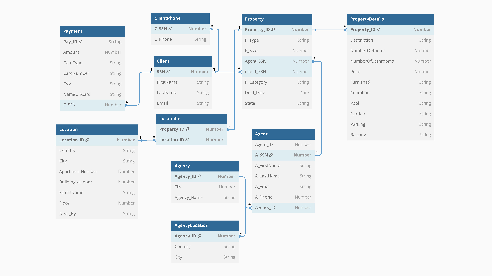

# Property Finder Application


## Table of Contents

- [Introduction](#introduction)
- [Features](#features)
- [Database Schema](#database-schema)
- [Tables and Descriptions](#tables-and-descriptions)
- [Form Usage Instructions](#form-usage-instructions)
- [Usage](#usage)
- [Installation](#installation)


## Introduction

Welcome to the Property Finder Application! This project was developed as part of a team assignment to create a comprehensive real estate management system. It manages properties, clients, payments, and more, providing an efficient platform for real estate transactions.

## Features

- Client information management
- Property listing and details management
- Payment processing and validation
- Location tracking for properties
- Agency and agent information management

## Database Schema



## Tables and Descriptions

### Client Table

- **client**: Stores client details such as SSN, first name, last name, and email.

### Client_Phone Table

- **client_phone**: Manages multiple phone numbers for each client.

### Payment Table

- **payment**: Records payment information including payment ID, amount, card details, and associated client SSN.

### Location Table

- **location**: Captures location specifics including country, city, apartment number, building number, street name, floor, and nearby landmarks.

### Property Table

- **property**: Contains detailed information about properties, including property ID, type, size, agent SSN, client SSN, category, deal date, and state.

### Located_IN Table

- **located_in**: Links properties to their specific locations.

### Property_Details Table

- **property_details**: Provides extensive details about properties such as descriptions, number of rooms and bathrooms, price, furnishing status, condition, and amenities.

### Agency Table

- **agency**: Stores details about real estate agencies, including agency ID, TIN, and agency name.

### Agency_Location Table

- **agency_location**: Records the location of agencies.

### Agent Table

- **agent**: Contains agent-specific information such as agent ID, SSN, first name, last name, email, and unique phone number.


### [Form Usage Instructions](#form-usage-instructions)

 [Form Usage Instructions PDF](Form_Usage_Instructions.pdf)

The "Form_Usage_Instructions.pdf" file provides step-by-step guidance on using the forms included in the Property Finder Application. It covers instructions for utilizing different components within the forms, such as checkboxes, radio buttons, triggers, alerts, calculated fields, LOVs, and master-detail forms.

### Canvas 1:
- **Check Box**: Use to select multiple options.
- **Radio Button**: Use to select a single option from multiple choices.
- **Run**: Execute the form to see the final look.

### Canvas 2:
- **Triggers**: Set up actions that occur in response to events.
- **Create Button**: Add a button to trigger specific actions.
- **Create Alert**: Set up an alert to display messages.
- **Alert Run**: Execute to see how alerts are displayed.
- **Combo Box**: Use for drop-down menu selections.

### Canvas 3:
- **Calculated Field (Formula)**: Add a field that calculates values based on a formula.
- **Run**: Execute to see the results of the calculated fields.

### Canvas 4:
- **LOV (List of Values)**: Create lists of values for selection.
  1. First list item
  2. Second list item
  3. Third list item
- **Run**: Execute to see the LOV in action.

### Canvas 5:
- **Master and Details**: Set up forms that show master-detail relationships.
- **Run**: Execute to see the master and detail forms in action.

Refer to the attached files for detailed instructions on setting up and using these forms.

## Usage

To use the Property Finder Application, follow these steps:

1. Clone the repository.
2. Set up the database using the provided SQL scripts.
3. Run the application to interact with the system as an admin, agent, or client.

## Installation

1. Clone the repository:
    ```bash
    git clone https://github.com/abraam318/property-finder.git
    ```
2. Navigate to the project directory:
    ```bash
    cd property-finder
    ```
3. Set up the database by running the provided SQL scripts.


